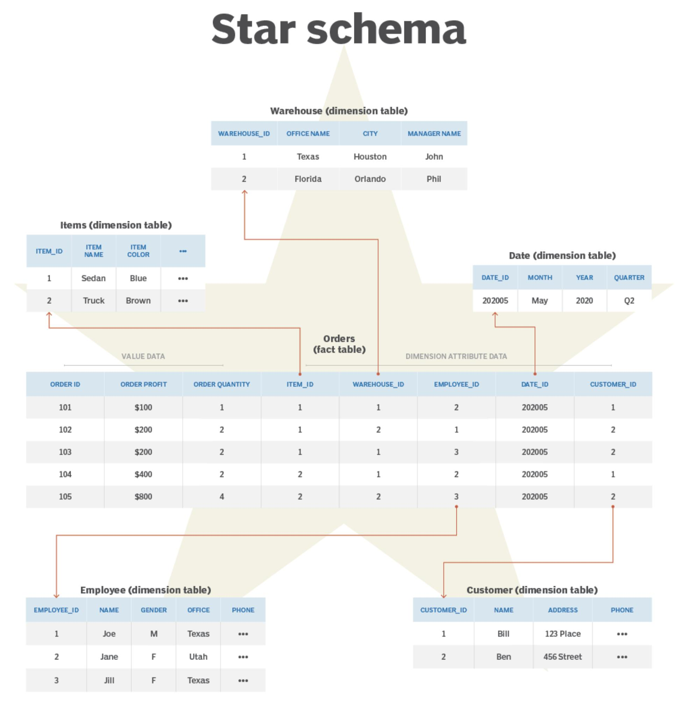

# E4 — Mise à disposition de flux de données

**Modalité d’évaluation :** E4  
**Compétences évaluées :** C8, C9, C10, C11, C12  
**Nature :** Mise en situation

## Objet de l’épreuve

Dans cette épreuve, je démontre ma capacité à extraire les données depuis plusieurs types de sources, à exécuter les requêtes nécessaires, à agréger les jeux de données, à structurer la base selon une modélisation cohérente et à exposer les résultats de manière exploitable.
Je vous joins dans les annexes le code source du projet executable pour les détails de chaque étape. Pour un exemple de workflow; se référer soit au readme.md soit au runbook.md

## 1. Extraction multi-sources

J’ai conçu l’ingestion autour de six sources hétérogènes afin de couvrir l’ensemble des modalités prévues par le référentiel :

| Source | Type | Méthode d’accès | Rôle dans le pipeline |
|--------|------|-----------------|-----------------------|
| Binance API | API REST | `GET /api/v3/klines`, `ticker/price`, `exchangeInfo` | OHLCV crypto, prix live, métadonnées |
| WebSocket Binance | flux temps réel | WebSocket | klines et carnet d’ordres |
| yfinance | bibliothèque / API | `Ticker.history()` | actifs traditionnels |
| CSV de référence | fichier structuré | lecture locale | métadonnées de symboles |
| JSON de configuration | fichier semi-structuré | lecture locale | contraintes d’investissement |
| CoinGecko | scraping HTML | parsing | enrichissement de contexte marché |
| PostgreSQL benchmarks | base relationnelle | requêtes SQL | indices de référence |

             +-------------------+
             |   Binance API     |
             +-------------------+
                       |
             +-------------------+
             | WebSocket Binance |
             +-------------------+
                       |
             +-------------------+
             |      yfinance     |
             +-------------------+
                       |
             +-------------------+
             |      CSV ref      |
             +-------------------+
                       |
             +-------------------+
             |   JSON config     |
             +-------------------+
                       |
             +-------------------+
             |   CoinGecko HTML  |
             +-------------------+
                       |
             +-------------------+
             | PostgreSQL Bench  |
             +-------------------+
                       |
                       v
             +-------------------+
             |  Ingestion Layer  |
             | Python collectors |
             +-------------------+
                       |
                       v
                 Bronze Layer

L’ingestion crypto représente environ 51 symboles sur 30 jours, soit près de 1 530 enregistrements par lot. L’ingestion traditionnelle couvre 33 actifs sur 30 jours, soit près de 990 enregistrements.

J’ai implémenté cette couche autour de scripts spécialisés : ingestion Binance, ingestion yfinance, ingestion des fichiers de référence, scraping CoinGecko et collecte PostgreSQL. L’ensemble est unifié par une logique d’orchestration qui permet d’invoquer les sources de manière homogène.

## 2. Requêtes SQL et préparation des données

La couche SQL intervient à deux niveaux.

### 2.1 Collecte et exploitation relationnelle

J’utilise des requêtes SQL pour :
- extraire les benchmarks depuis PostgreSQL ;
- interroger les tables analytiques du Data Warehouse ;
- vérifier la cohérence du schéma en étoile ;
- produire des vues d’analyse sur les prix, les symboles et les dates.

Le schéma logique principal est le suivant :
- `dim_symbol` pour les métadonnées métier des actifs ;
- `dim_date` pour la dimension temporelle ;
- `fact_prices` pour les données OHLCV ;
- `agg_daily_returns` et `portfolio_summary` pour les agrégats analytiques.

### 2.2 Requêtes analytiques

J’ai retenu DuckDB comme moteur analytique, car il permet :
- une lecture directe des fichiers Parquet ;
- des agrégations rapides ;
- un fonctionnement sans serveur ;
- une intégration naturelle avec dbt.

Les requêtes servent notamment à :
- compter les observations par symbole ;
- calculer des moyennes et maxima ;
- regrouper par secteur, actif ou période ;
- vérifier l’unicité et l’intégrité des données chargées.

## 3. Agrégation et transformation des données

```
                 DATA SOURCES
   ------------------------------------------------
   Binance | WebSocket | yfinance | CSV | JSON | DB
   ------------------------------------------------
                         |
                         v

                INGESTION LAYER
            Python collectors / scrapers
                         |
                         v

                STORAGE LAYER
            Parquet files (partitioned)

                         |
                         v

                ANALYTICAL ENGINE
                       DuckDB
                         |
                         v

                TRANSFORMATION
                     dbt
            Bronze → Silver → Gold
                         |
                         v

              DATA EXPOSURE LAYER
          +-------------------------+
          |       FastAPI           |
          | OpenAPI + Pydantic      |
          | Prometheus metrics      |
          +-------------------------+
                         |
                         v

                VISUALIZATION
                   Streamlit
           Portfolio analytics dashboard
```           
           
Une fois les données extraites, j’applique une chaîne de transformation organisée en trois zones :

| Zone | Contenu | Finalité |
|------|---------|----------|
| Bronze | données brutes par source | conserver les données telles qu’ingérées |
| Silver | données transformées | produire rendements, volatilité, corrélation, covariance |
| Gold | résultats métier | fournir poids optimaux, frontière efficiente et backtests |

Les traitements réalisés sont les suivants :
- nettoyage des valeurs nulles, `NaN` et `Inf` ;
- homogénéisation des formats ;
- calcul des rendements logarithmiques ;
- calcul de la volatilité annualisée ;
- production des matrices de corrélation et de covariance ;
- préparation des entrées nécessaires aux moteurs d’optimisation.

Les contrôles de qualité associés sont :
- prix strictement positifs (en considérant notre set d'actifs pour le MVP, en effet un actif peut avoir un prix négatif);
- cohérence `low <= open/close <= high` ;
- matrices symétriques ;
- somme des poids égale à 1 ;
- absence de positions négatives lorsque ce n’est pas autorisé.

## 4. Modélisation MERISE

La base analytique repose sur une modélisation [MERISE](../annexes/rapport/10_merise.md) en trois niveaux.

### 4.1 Modèle conceptuel

Les principales entités du modèle sont :
- `SYMBOL` pour les actifs financiers ;
- `DATE` pour la dimension temporelle ;
- `PRICE` pour les données de prix ;
- `PORTFOLIO` et `ALLOCATION` pour les allocations ;
- `BENCHMARK` et `BENCHMARK_PRICE` pour les références de comparaison.

### 4.2 Modèle logique

Le passage au modèle logique aboutit à :
- `dim_symbol(symbol, name, sector, category, asset_class, source, launch_year, consensus)` ;
- `dim_date(date, year, month, day, day_of_week)` ;
- `fact_prices(symbol, date, open, high, low, close, volume)` ;
- des structures complémentaires pour les portefeuilles et benchmarks.

### 4.3 Modèle physique

Au niveau physique, j’ai retenu :
- DuckDB comme moteur de l’entrepôt ;
- Parquet comme format principal de stockage ;
- un partitionnement par symbole pour les fichiers de données brutes ;
- dbt-duckdb pour la matérialisation des dimensions, faits et agrégats.

Les contraintes d’intégrité que j’applique sont :
- prix positifs ;
- `high >= low` ;
- `open` et `close` compris entre `low` et `high` ;
- intégrité référentielle entre faits et dimensions ;
- règles métier comme l’unicité du prix par couple `(symbol, date)`.

## 5. Mise à disposition des données

La mise à disposition des données s’effectue de trois manières.

```
                    DATA STORAGE
         ---------------------------------
         | Parquet Files | CSV | JSON    |
         ---------------------------------
                     |
                     v

               DuckDB Engine
           (SQL in-process queries)
                     |
                     v

              DATA ACCESS LAYER
        --------------------------------
        |           FastAPI             |
        |  OpenAPI documentation        |
        |  Pydantic validation          |
        |  Dependency injection         |
        |  Prometheus metrics           |
        --------------------------------
           |          |          |
           v          v          v

       Symbol API   Price API   Portfolio API
                     |
                     v

               CLIENT APPLICATIONS
         ---------------------------------
         | Streamlit dashboard           |
         | Data analysts (SQL queries)   |
         | External applications         |
         ---------------------------------
```

### 5.1 Fichiers et accès analytiques

- accès aux fichiers Parquet via le système de fichiers ;
- accès SQL in-process dans DuckDB ;
- accès aux données de référence via CSV et JSON.

### 5.2 API REST

J’expose les données et résultats via FastAPI. Cette couche apporte :
- une documentation OpenAPI générée automatiquement ;
- des schémas Pydantic pour valider les entrées et sorties ;
- des messages d’erreur explicites ;
- un fonctionnement compatible avec l’injection de dépendances ;
- des métriques Prometheus pour l’observabilité.

L’API couvre :
- la consultation des symboles ;
- les données de prix ;
- les métriques financières ;
- les portefeuilles optimisés ;
- les sorties de backtest ;
- les comparaisons entre stratégies.

### 5.3 Tableau de bord

Le tableau de bord Streamlit constitue la couche de restitution pour les utilisateurs finaux. Il permet d’explorer :
- les métriques de portefeuille ;
- les poids optimaux ;
- la comparaison entre stratégies ;
- les visualisations de risque et de performance ;
- les résultats de backtesting.

## 6. Démonstration de la chaîne complète

[lien runbook pour un exemple d'execution](../annexes/operations/runbook.md)

La séquence de démonstration que je retiens est la suivante :
1. lancer l’ingestion multi-sources ;
2. montrer la production des fichiers Bronze ;
3. lancer la transformation vers Silver et Gold ;
4. exécuter une requête SQL dans DuckDB ;
5. présenter le schéma MERISE et le schéma en étoile ;
6. ouvrir la documentation API et restituer un résultat métier.

## Conclusion

Dans cette épreuve, je démontre une chaîne cohérente de bout en bout : extraction, requêtes, agrégation, modélisation et exposition. La valeur de la solution ne repose pas sur une seule brique technique, mais sur l’enchaînement maîtrisé de tous les composants nécessaires à la mise à disposition de flux de données fiables et exploitables.
