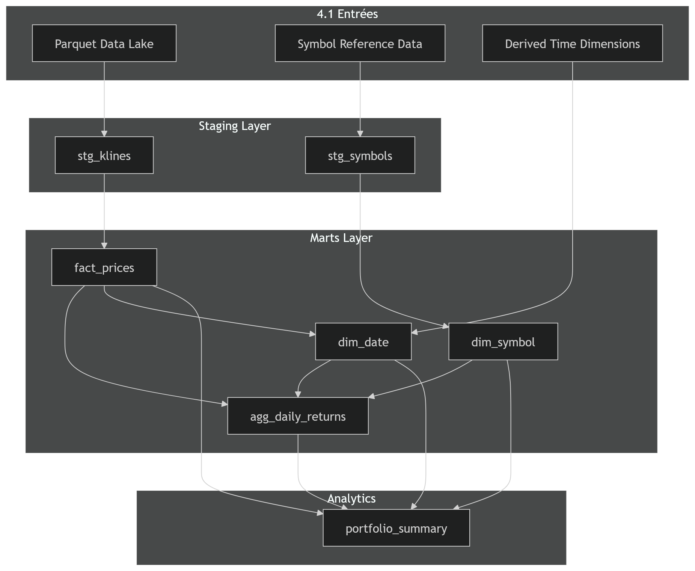

# E5 — Mise en place d’un DWH

**Modalité d’évaluation :** E5  
**Compétences évaluées :** C13, C14, C15  
**Nature :** Mise en situation

## Objet de l’épreuve

Dans cette épreuve, je démontre ma capacité à modéliser un entrepôt de données, à l’implémenter concrètement et à l’alimenter au moyen d’ETL cohérents avec les usages analytiques du projet.

## 1. Finalité du Data Warehouse

le DHW est la pour séparer clairement :
- les données brutes du Data Lake ;
- les données transformées destinées aux calculs ;
- les structures optimisées pour les requêtes d’analyse et d’aide à la décision.

Le rôle du DWH est de :
- centraliser les faits de prix dans un format interrogeable en SQL ;
- porter une modélisation stable pour les analyses ;
- faciliter la restitution des métriques ;
- offrir une base lisible aux utilisateurs métier et analytiques.

## 2. Modélisation du schéma analytique

### 2.1 Structure retenue

[Détails du modele dimensionnel](../annexes/rapport/02_cartographie_donnees.md) (section 4. Modele dimensionnel (Star Schema))

J’ai choisi un **schéma en étoile**, car il répond directement au besoin d’analyse du projet.

| Élément | Rôle |
|---------|------|
| `fact_prices` | table de faits contenant les observations OHLCV |
| `dim_symbol` | dimension métier des actifs |
| `dim_date` | dimension temporelle |
| `agg_daily_returns` | agrégat de rendements journaliers |
| `portfolio_summary` | synthèse analytique portefeuille |

### 2.2 Justification du choix

Ce modèle me permet :
- de conserver une lecture simple des données ;
- de faciliter les jointures entre faits et dimensions ;
- d’optimiser les agrégations ;
- de répondre rapidement à des questions métier par symbole, secteur, classe d’actif ou période.

### 2.3 Données de référence intégrées

La dimension `dim_symbol` couvre à la fois :
- les actifs crypto ;
- les actifs traditionnels ;
- les métadonnées comme le secteur, la catégorie, la source, l’année de lancement et le consensus.

La dimension `dim_date` fournit :
- l’année ;
- le mois ;
- le jour ;
- le jour de semaine.

## 3. Implémentation technique du DWH

Ce diagramme simplifié des flux illustre la frontière du data lake et data wharehouse
```
                            ┌───────────────────┐
                            │  Sources externes │
                            │ Binance, Yahoo... │
                            └────────┬──────────┘
                                     │ F1-F6
                                     ▼
┌─────────┐       ┌──────────┐      ┌───────────────┐
│WebSocket│─────▶│ Redpanda │─────▶│ Consumer      │
│Producer │       │ (Kafka)  │      │ micro-batch   │
└─────────┘       └──────────┘      └──────┬────────┘
                                           │
                                           ▼

                ╔══════════════════════════════╗
                ║           DATA LAKE          ║
                ║                              ║
                ║        ┌──────────┐          ║
                ║        │ Bronze   │          ║
                ║        │ raw data │          ║
                ║        └──────────┘          ║
                ╚═════════════┬════════════════╝
                              │
                              ▼

                ╔══════════════════════════════╗
                ║        DWH ANALYTICS         ║
                ║                              ║
                ║        ┌──────────┐          ║
                ║        │ Silver   │          ║
                ║        │ cleaned  │          ║
                ║        │ normalized│         ║
                ║        └──────────┘          ║
                ╚═════════════┬════════════════╝
                              │
                              ▼

                ╔══════════════════════════════╗
                ║        DWH MODELS            ║
                ║                              ║
                ║        ┌──────────┐          ║
                ║        │ Gold     │          ║
                ║        │ features │          ║
                ║        │ signals  │          ║
                ║        └──────────┘          ║
                ╚═════════════┬════════════════╝
                              │
                              ▼
                        ┌──────────┐
                        │ FastAPI  │
                        └────┬─────┘
                             │
         ┌───────────────────┼───────────────────┐
         ▼                   ▼                   ▼
   ┌──────────┐        ┌──────────┐        ┌──────────┐
   │Streamlit │        │ Client   │        │Prometheus│
   └──────────┘        └──────────┘        └────┬─────┘
                                                ▼
                                          ┌──────────┐
                                          │ Grafana  │
                                          └──────────┘
```

---

### 3.1 Choix de DuckDB

J’ai retenu DuckDB pour les raisons suivantes :
- moteur OLAP embarqué, sans serveur ;
- lecture directe des fichiers Parquet ;
- simplicité de déploiement ;
- excellente adéquation avec un projet local et analytique ;
- intégration naturelle avec dbt.

### 3.2 Structure physique

L’implémentation physique repose sur :
- un Data Lake en fichiers Parquet ;
- un fichier `warehouse.duckdb` pour l’entrepôt ;
- des modèles dbt pour le staging et les marts ;
- une orchestration Airflow pour industrialiser les chargements.

La structure générale est la suivante :
- `data/raw/` pour les données brutes ;
- `data/processed/` pour les données transformées ;
- `data/output/` pour les résultats métier ;
- `data/warehouse.duckdb` pour le DWH ;
- `dbt_project/` pour les modèles SQL.

### 3.3 Contraintes et intégrité

J’applique les contraintes suivantes :
- prix strictement positifs ;
- `high >= low` ;
- `open` et `close` compris entre `low` et `high` ;
- unicité du prix par symbole et date ;
- intégrité référentielle entre `fact_prices`, `dim_symbol` et `dim_date`.

## 4. ETL et alimentation de l’entrepôt

L’alimentation du DWH suit une logique en plusieurs étapes. 
Voici un diagramme simplifié du process d'alimentation.
```
                DATA SOURCES
        Binance | Yahoo | WebSocket
                     │
                     ▼
              INGESTION LAYER
         (batch + streaming unified)
                     │
                     ▼
                EVENT BUS
             (Kafka / Redpanda)
                     │
                     ▼
                   BRONZE
           raw_market_data parquet
                     │
                     ▼
                   SILVER
         returns | volatility | cov
                     │
                     ▼
                    GOLD
    portfolio_weights | frontier | backtest
                     │
                     ▼
                  SERVING
         DuckDB | FastAPI | Streamlit
                     │
                     ▼
                     DBT

                    Pipeline parallele : dbt
[raw/klines/*.parquet] → stg_klines → stg_symbols
                                    → fact_prices → agg_daily_returns
                                    → dim_symbol     portfolio_summary
                                    → dim_date
                        (materialise dans warehouse.duckdb)
```

### 4.1 Entrées



### 4.2 Étapes de transformation
## Data Transformation Flow

Les transformations SQL sont organisées en deux niveaux :

| Niveau | Rôle |
|--------|------|
| `staging` | typage, nettoyage, homogénéisation des sources |
| `marts` | création des faits, dimensions et agrégats |

Les modèles principaux sont :
- `stg_klines` ;
- `stg_symbols` ;
- `fact_prices` ;
- `dim_symbol` ;
- `dim_date` ;
- `agg_daily_returns` ;
- `portfolio_summary`.

### 4.3 Orchestration

L’exécution du DWH s’intègre dans le DAG Airflow :
- ingestion des données ;
- transformation Python ;
- chargement et matérialisation dbt ;
- exposition vers l’API et le tableau de bord.

## 5. Tests et qualité – Data Quality Flow

                         +----------------------+
                         |   Data Warehouse     |
                         |      (Tables)        |
                         +----------+-----------+
                                    |
                                    v
                     +-------------------------------+
                     |           DBT TESTS           |
                     |-------------------------------|
                     | - not_null                    |
                     | - unique                      |
                     | - relationship (fact ↔ dim)   |
                     | - assert_positive_volumes     |
                     +---------------+---------------+
                                     |
                                     v
                     +-------------------------------+
                     |        PIPELINE TESTS         |
                     |-------------------------------|
                     | - Python validation tests     |
                     +---------------+---------------+
                                     |
                                     v
                 +--------------------------------------------+
                 |            QUALITY CRITERIA                |
                 |--------------------------------------------|
                 | ✓ Key uniqueness                           |
                 | ✓ No null values on critical columns       |
                 | ✓ Price & volume consistency               |
                 | ✓ Correct warehouse loading                |
                 +--------------------------------------------+
Le DWH n’est pas seulement modélisé ; il est vérifié.

J’utilise :
- des tests dbt de type `not_null` ;
- des tests dbt de type `unique` ;
- des tests de relation entre faits et dimensions ;
- un test personnalisé `assert_positive_volumes` ;
- des tests Python complémentaires côté pipeline.

Les critères de qualité couverts sont :
- unicité des clés ;
- absence de valeurs nulles sur les colonnes critiques ;
- cohérence des volumes et des prix ;
- qualité des chargements dans l’entrepôt.

## 6. Documentation et exploitabilité

J’ai documenté :
- la modélisation MERISE ;
- les dépendances techniques nécessaires ;
- les commandes d’exécution ;
- la logique d’ingestion incrémentale ;
- la séparation entre le Data Lake, le DWH et les agrégats de restitution.

Cette documentation permet :
- de reproduire l’installation ;
- de rejouer les chargements ;
- de comprendre la logique des transformations ;
- de faire évoluer le schéma de manière contrôlée.

Pour plus de détail sur mes modèles de données, ci-après le lien:
[lien vers les détails de la modélisation merise](../annexes/rapport/10_merise.md)


## Conclusion

Le DWH que je mets en place répond aux attentes du référentiel : il est modélisé, implémenté, alimenté et testé. Il constitue la couche analytique stable du projet et s’inscrit dans une chaîne cohérente allant du Data Lake aux usages métier.
